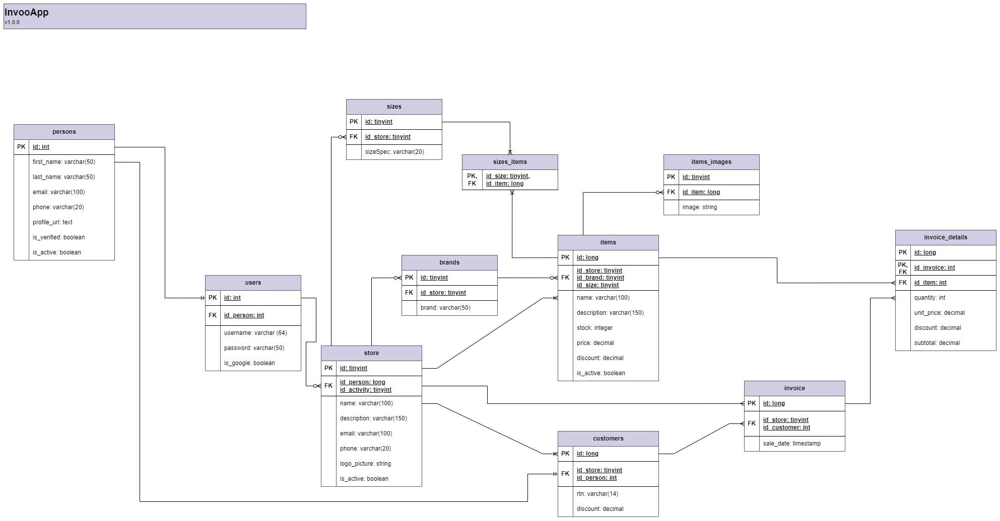

# Invoo App API

   
   

✨ Rest API to help business owners to manage their inventory and invoicing.

## ⚡️ Description
SAAS that simplifies stock management, ensures accurate billing, and provides tools to help businesses stay organized and efficient.

## 👨‍💻 Documentation OpenAPI
> Test with `Prod Env` or `Dev Env` if your using in your localhost.
- [Review Collections & Documentation](https://example.com) 

## 🤖 General Database Diagram

   

## 🚀 Setup
1. Clone this project: `git clone https://github.com/chrisjosuedev/invoo-app-backend.git`
2. Go to the project folder:
   `cd invoo-app-backend`
3. Run `npm i` to install all dependencies
4. Run `npm run start:dev` to run in development mode.

## 🛠 Run

1. Once the dependencies are installed, you can run via command line.
2. Test Endpoints via Postman (or your preferred API tester) on port 9090: `http://localhost:9090/api/v1/...`
   > Please check the documentation (Postman/Swagger) above to see the available endpoints and change `Dev Env`

## 🦀 Technologies

## 🧾 License

The MIT License (MIT)
